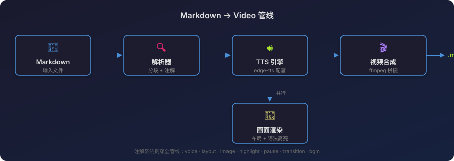

# markdown-to-video

将 Markdown 文件一键转换成带 AI 配音的视频，面向技术博客/教程创作者。

## 工作原理



根据 markdown 标题自动分页，每种类型的内容使用不同的画面模板：

| 类型 | 模板 | 效果 |
|------|------|------|
| `# 一级标题` | 封面页 | 标题居中 + 渐变背景 |
| `## ~ ######` | 内容页 | 标题栏 + 正文展示 |
| `` ```code``` `` | 代码页 | 深色终端风格，左上角红黄绿圆点 |
| 列表 | 列表页 | 标题 + 圆点列表 |

## 安装

```bash
# 克隆项目
git clone git@github.com:EasyRoc/markdown-to-video.git
cd markdown-to-video

# 创建虚拟环境并安装依赖
python -m venv .venv
source .venv/bin/activate
pip install -r requirements.txt

# 确保已安装 ffmpeg
brew install ffmpeg   # macOS
```

## 使用

```bash
# 一键生成视频
python main.py my-tutorial.md

# 预览分段效果，不生成视频
python main.py my-tutorial.md --dry-run

# 使用自定义配置
python main.py my-tutorial.md -c my-config.yaml
```

输出视频与 markdown 同名：`my-tutorial.md` → `output/my-tutorial.mp4`

### V3 教学导演模式

V3 会先把 Markdown 转成教学讲稿、分镜和时间线，再复用现有渲染与合成流程：

```bash
python main.py my-tutorial.md --v3
python main.py my-tutorial.md --v3 --dry-run
```

`--v3 --dry-run` 会输出 storyboard 摘要，并写入这些调试文件：

- `cache/script/<source-hash>.json`
- `cache/storyboard/<source-hash>.json`
- `cache/timeline/<source-hash>.json`

默认情况下，不加 `--v3` 仍然使用原有 V2 分段渲染流程。

## 配置

编辑 `config.yaml` 自定义生成效果：

```yaml
tts:
  voice: "zh-CN-XiaoxiaoNeural"   # TTS 声音
  speed: "+0%"                     # 语速 (-50% ~ +100%)
  pitch: "+0Hz"                    # 音调

render:
  width: 1920                      # 视频分辨率
  height: 1080
  max_chars_per_segment: 200       # 每页最大字数
  font_size_title: 72              # 标题字号
  font_size_body: 40               # 正文字号
  bg_color: "#f5f5f5"             # 背景色
  accent_color: "#4A90D9"         # 强调色

video:
  fps: 30
  output_dir: "./output"
```

## 可选声音

```bash
# 查看所有可用中文声音
edge-tts --list-voices | grep zh-CN
```

常用声音：`zh-CN-XiaoxiaoNeural`（女声）、`zh-CN-YunxiNeural`（男声）、`zh-CN-XiaoyiNeural`（女声活泼）

## 中间产物

运行后中间文件缓存在 `cache/` 目录：

- `cache/audio/` — TTS 音频（以文本 hash 命名）
- `cache/frames/` — 渲染的 PNG 画面

删除 `cache/` 目录即可强制重新生成全部内容。

## 运行测试

```bash
source .venv/bin/activate
python -m pytest tests/ -v
```

## 项目结构

```
├── main.py              # CLI 入口
├── config.yaml          # 默认配置
├── src/
│   ├── config.py        # 配置加载与合并
│   ├── parser.py        # Markdown 解析与分段
│   ├── tts.py           # edge-tts 语音生成
│   ├── renderer.py      # PIL 画面渲染（4种模板）
│   └── composer.py      # ffmpeg 视频合成
├── cache/               # 中间产物缓存
├── output/              # 视频输出
└── tests/               # 测试
```
