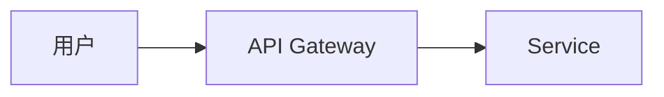

# Markdown to Video V2 — 设计文档

## 概述

V2 从「机械拼装」升级为「导演级创作工具」。核心变化：

1. **注解系统** — 在 markdown 中嵌入导演指令，精确控制每个画面的表现
2. **配图能力** — 支持本地素材 + 在线图库自动搜索
3. **混合布局** — 图文混排，4 种布局模式
4. **画面增强** — 代码语法高亮、Mermaid 图表渲染、关键词高亮
5. **音频增强** — 背景音乐（人声 ducking）、多音色切换、自然停顿
6. **视频特效** — 段落间转场、章节进度条

---

## 一、注解系统

### 1.1 设计理念

在 markdown 中用 HTML 注释嵌入导演指令，不影响 markdown 的纯文本可读性。无注解时回退到 V1 默认行为。

### 1.2 语法

```markdown
<!-- {"key": "value"} -->

<!--
{
  "voice": "zh-CN-YunxiNeural",
  "speed": "-10%",
  "image": "./assets/architecture.png",
  "layout": "image-right"
}
-->
```

单行或多行 JSON 均支持。注解对其后的第一个段落生效。

### 1.3 指令表

| 指令 | 类型 | 默认值 | 说明 |
|------|------|--------|------|
| `voice` | string | config 默认 | 覆盖当前段 TTS 声音 |
| `speed` | string | `"+0%"` | 语速，如 `"-10%"`, `"+20%"` |
| `pitch` | string | `"+0Hz"` | 音调 |
| `image` | string | null | 配图路径，支持相对/绝对路径和 URL |
| `layout` | string | `"text-only"` | 布局模式：`text-only`, `image-right`, `image-below`, `image-full` |
| `pause_before` | float | 0 | 段落前停顿秒数 |
| `pause_after` | float | 0 | 段落后停顿秒数 |
| `highlight` | string | null | 要高亮的关键词（在画面上用强调色渲染） |
| `bgm` | string | null | 背景音乐路径，`"none"` 关闭 |
| `bgm_volume` | float | `0.15` | 背景音乐音量 (0.0-1.0) |
| `transition` | string | `"none"` | 转场效果：`none`, `fade`, `slide-left`, `slide-right` |

### 1.4 解析流程

```
Markdown 文本
    ↓
正则匹配 <!-- ... --> 注释块
    ↓
尝试 JSON.parse → 成功则为注解
    ↓
注解绑定到紧随其后的第一个非空行所属的 Segment
    ↓
Segment.annotations = {合并后的指令}
```

### 1.5 示例

```markdown
# Python 异步编程指南

<!-- {"bgm": "./assets/tech-bgm.mp3", "bgm_volume": 0.12} -->

Python 的异步编程是现代后端开发的核心技能。

<!-- {"pause_before": 1.5, "voice": "zh-CN-YunxiNeural"} -->

## 事件循环原理

<!-- {"image": "./assets/event-loop.png", "layout": "image-right"} -->

事件循环是 asyncio 的心脏。它维护一个任务队列...

<!-- {"highlight": "协程不是线程！", "pause_after": 1.0} -->

协程不是线程——它运行在单线程中，通过协作式调度切换上下文。

<!-- {"transition": "fade"} -->

## 实战示例
```

---

## 二、配图系统

### 2.1 图片来源优先级

```
1. 注解中显式指定的 image 路径（本地文件或 URL）
2. 本地素材库匹配（基于段落关键词）
3. 在线图库搜索（Unsplash API，可选启用）
```

### 2.2 本地素材库

`assets/images/` 目录 + `assets/images/manifest.yaml`：

```yaml
# manifest.yaml — 素材索引
images:
  - file: python-logo.png
    keywords: [python, 编程, 开发]
  - file: architecture-diagram.png
    keywords: [架构, 系统设计, 数据流]
  - file: docker-container.png
    keywords: [docker, 容器, 部署]
```

匹配逻辑：对段落文本做关键词提取，与 manifest 做余弦相似度匹配（或简单关键词交集），取最高分且超过阈值的图片。

### 2.3 在线图库（可选扩展）

```yaml
image_provider:
  unsplash:
    enabled: false           # 默认关闭
    access_key: ""
    orientation: "landscape"
```

Unsplash API 免费额度 50 次/小时，足以覆盖单篇文章的配图。

### 2.4 图片缓存与处理

- URL 图片下载后缓存在 `cache/images/`
- 自动缩放/裁剪到布局所需尺寸
- 模糊背景生成：图片不够大时，用原图高斯模糊铺满背景

---

## 三、布局系统

### 3.1 四种布局模式

```
text-only（默认）          image-right
┌──────────────┐    ┌────────┬───────┐
│   标题        │    │  标题          │
│              │    │        │        │
│   正文       │    │  正文  │  图片  │
│              │    │        │        │
│              │    │        │        │
└──────────────┘    └────────┴───────┘

image-below              image-full
┌──────────────┐    ┌──────────────┐
│   标题        │    │              │
│              │    │              │
│   正文       │    │    图片      │
│              │    │   (全屏)     │
│   ───────    │    │              │
│    图片      │    │  标题浮层    │
└──────────────┘    └──────────────┘
```

### 3.2 布局渲染管线

```
Segment + annotations
    ↓
LayoutFactory.select(layout_type)
    ↓
Layout.render(canvas, fonts, content) → Image
    ├─ _draw_title_area()
    ├─ _draw_body_area()
    ├─ _draw_image_area()
    └─ _draw_highlight()
```

### 3.3 新增模块

```
src/layouts/
├── __init__.py          # LayoutFactory
├── base.py              # BaseLayout 抽象类
├── text_only.py         # 纯文本（V1 行为）
├── image_right.py       # 左文右图
├── image_below.py       # 上文下图
└── image_full.py        # 全屏图 + 浮层标题
```

---

## 四、画面增强

### 4.1 代码语法高亮

使用 Pygments 解析代码为 token 流，按语言规则着色：

```python
from pygments import highlight
from pygments.lexers import get_lexer_by_name
from pygments.token import Token

# 新增依赖: pygments
```

渲染时按 token 类型映射颜色，逐 word 绘制到终端背景上，替代当前的纯白等宽字。

配置：
```yaml
code_highlight:
  theme: "monokai"        # 配色主题
  line_numbers: true      # 行号
```

### 4.2 Mermaid 图表渲染

Mermaid 代码块不再显示源码，而是渲染为实际图表：

```markdown

```

渲染方案：调用 `mmdc` (mermaid-cli) 生成 PNG，作为图片嵌入。

```
mermaid markdown → 写入临时 .mmd 文件 → mmdc -i input.mmd -o output.png → 当作 image 嵌入
```

检测逻辑：code block 的 info string 为 `mermaid` 时，标记 `render_as: "mermaid"`。

### 4.3 关键词高亮

注解中指定的 `highlight` 文本，在画面上用强调色 + 加粗渲染，可配合轻微放大：

```markdown
<!-- {"highlight": "关键结论：异步优于多线程"} -->
```

渲染时：在正文中找到匹配子串 → 用 `accent_color` + `font_size_body + 6` 重绘。

---

## 五、音频增强

### 5.1 背景音乐

配置：
```yaml
audio:
  default_bgm: null       # 默认无 BGM
  bgm_volume: 0.15        # 0.0-1.0
  ducking:
    enabled: true         # 人声时自动降低 BGM
    reduction_db: 12      # 降低多少分贝
    attack_ms: 150        # 淡出速度
    release_ms: 400       # 恢复速度
```

实现：ffmpeg 的 `sidechaincompress` 滤镜实现 sidechain ducking：

```
人声轨道 → sidechain → 压缩 BGM 轨道
```

### 5.2 多音色

通过注解切换声音。同一个 markdown 中：
- 标题/概念讲解用男声 (`YunxiNeural`)
- 代码示例用女声 (`XiaoxiaoNeural`)
- 注意事项用活泼声音 (`XiaoyiNeural`)

TTS 模块改为接受 `voice/speed/pitch` 参数，而非从 config 统一读取。

### 5.3 自然停顿

即使不写 `pause` 注解，自动添加智能停顿：

| 场景 | 默认停顿 |
|------|---------|
| 标题页后 | 1.0s |
| 代码块前后 | 0.5s |
| 列表项之间 | 0.2s |

实现：在 composer 中注入静音片段，或调整 concat 文件的 duration。

---

## 六、视频增强

### 6.1 转场效果

段落间插入转场动画。ffmpeg 的 `xfade` 滤镜支持：

```bash
ffmpeg -i seg0.mp4 -i seg1.mp4 -filter_complex "xfade=transition=fade:duration=0.5:offset=14.5" output.mp4
```

转场类型：
- `fade`: 交叉淡入淡出
- `slide-left`: 向左滑出/滑入
- `slide-right`: 向右滑出/滑入
- `none`: 硬切

配置：
```yaml
video:
  default_transition: "fade"
  transition_duration: 0.5   # 秒
```

### 6.2 章节进度条

每帧底部渲染 4px 高的进度条：

```
┌──────────────────────────────────┐
│                                  │
│         画面内容                  │
│                                  │
├──────████████████░░░░░░░░────────┤  ← 进度条
│  章节1  │    章节2   │  章节3   │
└──────────────────────────────────┘
```

- 进度条根据 TTS 时长计算各章节占比
- 颜色使用 `accent_color`
- 在 renderer 阶段直接画到每帧 PNG 上

---

## 七、架构变化

### 7.1 新增文件

```
src/
├── annotations.py      # 注解解析器
├── image_provider.py   # 图片获取（本地+在线）
├── highlight.py        # 关键词高亮渲染
├── layouts/            # 布局系统
│   ├── __init__.py
│   ├── base.py
│   ├── text_only.py
│   ├── image_right.py
│   ├── image_below.py
│   └── image_full.py
├── syntax_highlighter.py  # Pygments 代码着色
└── mermaid_renderer.py    # Mermaid → PNG
```

### 7.2 修改文件

| 文件 | 变更 |
|------|------|
| `src/parser.py` | Segment 加 `annotations` 字段；解析 HTML 注释 |
| `src/tts.py` | `generate_audio()` 接受 voice/speed/pitch 参数；支持停顿 |
| `src/renderer.py` | 委托给 layout 系统；废弃旧渲染函数 |
| `src/composer.py` | 支持转场、BGM、音频 ducking |
| `src/config.py` | 新增 image/highlight/audio/transition 配置项 |
| `config.yaml` | 新增全部 V2 配置 |
| `main.py` | 传递新参数 |

### 7.3 Segment 数据结构变化

```python
@dataclass
class Segment:
    index: int
    title: str
    level: int
    type: str              # title_slide | section | code_block | list | mermaid
    text: str
    duration: float = 0

    # V2 新增
    annotations: dict = field(default_factory=dict)
    image_path: str | None = None
    layout: str = "text-only"
    pause_before: float = 0.0
    pause_after: float = 0.0
    highlight: str | None = None
    voice: str | None = None
    speed: str | None = None
    pitch: str | None = None
    bgm: str | None = None
    bgm_volume: float = 0.15
    transition: str = "none"
```

---

## 八、V2 完整配置

```yaml
tts:
  voice: "zh-CN-XiaoxiaoNeural"
  speed: "+0%"
  pitch: "+0Hz"
  retry: 1

render:
  width: 1920
  height: 1080
  font_family: "/System/Library/Fonts/STHeiti Medium.ttc"
  font_family_mono: "/System/Library/Fonts/SFNSMono.ttf"
  font_size_title: 72
  font_size_body: 40
  font_size_code: 34
  bg_color: "#f5f5f5"
  code_bg_color: "#1e1e1e"
  accent_color: "#4A90D9"
  text_color: "#333333"
  light_text_color: "#e0e0e0"
  max_chars_per_segment: 200

# V2 新增
image:
  assets_dir: "./assets/images"
  manifest_file: "./assets/images/manifest.yaml"
  unsplash:
    enabled: false
    access_key: ""

highlight:
  font_scale: 1.15
  color_override: null    # 不设置则用 accent_color

code_highlight:
  theme: "monokai"
  line_numbers: true

audio:
  default_bgm: null
  bgm_volume: 0.15
  ducking:
    enabled: true
    reduction_db: 12
    attack_ms: 150
    release_ms: 400
  smart_pauses:
    after_title: 1.0
    around_code: 0.5
    between_list_items: 0.2

video:
  fps: 30
  codec: "libx264"
  audio_codec: "aac"
  audio_bitrate: "192k"
  output_dir: "./output"
  default_transition: "fade"
  transition_duration: 0.5
  progress_bar: true
```

---

## 九、实施分 Phase

### Phase 2.1：注解系统 + Segment 模型升级
- 新增 `annotations.py`
- 修改 `parser.py`：解析 HTML 注释注解、Segment 字段扩展
- 修改 `main.py`：传递注解到下游

### Phase 2.2：配图 + 布局系统
- 新增 `image_provider.py`
- 新增 `layouts/` 全部文件
- 重构 `renderer.py` 委托给 layout 系统
- 废弃 V1 的 4 个 `_render_*` 函数

### Phase 2.3：画面增强
- 新增 `syntax_highlighter.py`（Pygments 着色）
- 新增 `mermaid_renderer.py`（调用 mmdc）
- 新增 `highlight.py`（关键词高亮渲染）
- 修改 parser：识别 mermaid 代码块类型

### Phase 2.4：音频增强
- 修改 `tts.py`：参数化 voice/speed/pitch
- 修改 `composer.py`：BGM 混音 + ducking
- 修改 parser：智能停顿注入

### Phase 2.5：视频特效
- 修改 `composer.py`：xfade 转场
- 修改 renderer/layouts：进度条渲染
- 修改 `config.py` + `config.yaml`：新配置项

---

## 十、V2 范围外

- 视频预览/实时编辑 GUI
- AI 语音克隆
- AI 生图（DALL-E/Stable Diffusion）
- 自动字幕生成（SRT/VTT）
- 多语言翻译 + 配音
- 协作编辑 / 云存储
